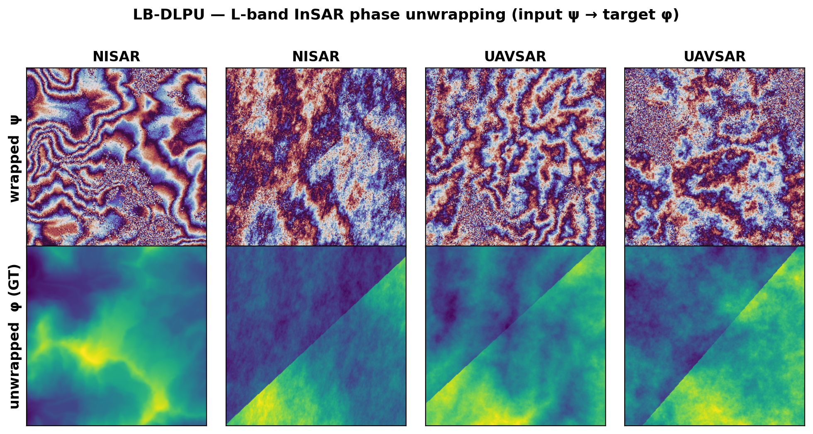

# LB-DLPU: An L-Band (NISAR/UAVSAR) Benchmark for InSAR Phase Unwrapping



LB-DLPU is a physically-simulated benchmark for **InSAR phase unwrapping at L-band**,
calibrated to the **NISAR** (spaceborne, 20 m) and **UAVSAR** (airborne, 6 m) regimes.
It provides **10,000** 256×256 patches, each with the wrapped phase (network input),
the ground-truth absolute phase (target), coherence, per-edge five-arc integer ambiguity
labels, residues, and a validity mask — everything needed to train, validate, and test
learning-based *and* classical unwrappers. A wrapped-phase PNG quicklook accompanies every
patch.

Two properties set it apart from existing (C-band, RMSE-only) PU datasets:

- **Well-posedness certificate** — every scene is *provably* recoverable: a noiseless-oracle
  minimum-cost-flow (MCF) unwrapper reconstructs each patch to within **0.035 rad** given the
  correct per-edge costs (100% of 10,000 scenes pass). Any error a method incurs is
  attributable to the method, not to an unsolvable target.
- **Sensor calibration** — coherence (Beta fits), Cramér–Rao phase noise, and an ionospheric
  screen (NISAR, at the measured *f*^−2.4 spectral slope) are calibrated to real NISAR L2 GUNW
  and UAVSAR granules; the synthetic residue density brackets the real measurement in both
  regimes.

## 📦 Get the dataset

The dataset (≈9 GB) is hosted on **HuggingFace** and archived on **Zenodo**:

- **HuggingFace:** https://huggingface.co/datasets/TheDagbanja/L-Band_DLPU
- **Zenodo (DOI):** https://doi.org/10.5281/zenodo.21768604

```bash
huggingface-cli download TheDagbanja/L-Band_DLPU --repo-type dataset --local-dir LB_DLPU
```

## Structure

```
LB_DLPU/
├── sim/                    10,000 per-patch HDF5 files
│   ├── train/  000000.h5 … 007999.h5   (8,000)
│   ├── val/    008000.h5 … 008999.h5   (1,000)
│   └── test/   009000.h5 … 009999.h5   (1,000)
├── sim_wrapped_png/        wrapped-phase quicklooks, mirroring sim/
├── index.jsonl             per-patch metadata (no arrays)
├── dem_manifest.csv        DEM tile → split assignment (whole-tile, leakage-free)
└── datasheet.md            statistics + well-posedness certificate
```

Per-patch HDF5 datasets: `psi` (wrapped phase, input), `phi` (absolute phase, target),
`coherence`, `kx`/`ky` (per-edge integer ambiguity, {−2,…,+2}), `residues`, `water_mask`,
plus per-patch attributes. See the
[dataset card](https://huggingface.co/datasets/TheDagbanja/L-Band_DLPU) for the full schema.

## Code

This repository holds the dataset generator, sensor calibration, evaluation harness, and
reference baselines. The dataset itself (≈9 GB) lives on HuggingFace / Zenodo (above).

| Path | Contents |
|---|---|
| `src/` | dataset generator + calibration (`synth_lband.py`, `synthetic_engine.py`, `lband_dataset.py`), residue-free MCF solver (`mcf.py`), sensor loaders (`nisar_gunw.py`, `uavsar_io.py`), classical baselines (`baselines.py`), deep baselines (`baselines_dl/`) |
| `eval/` | method-blind evaluation harness: metrics (`metrics.py`), driver (`eval_baselines.py`), aggregation + significance tests (`report.py`), method registry (`methods/`) |
| `scripts/` | `train_baseline.py` (train the deep baselines), `unwrap_dl_geotiff.py` (whole-scene tiled DL inference + stitching), `preview_scenes.py` |
| `configs/` | Hydra configs for baseline training |

```bash
pip install -r requirements.txt

# score every method (classical + minimum-cost-flow + deep) on the frozen test split
python -m eval.eval_baselines --help
```

The harness scores each unwrapper per regime × difficulty on RMSE, MAE, PSNR, SSIM,
cycle-slip (jump) rate, residue count, % residue-free, and five-arc |k|≥2 edge accuracy,
and emits `leaderboard.csv` / `leaderboard.md` plus paired significance tests. The
minimum-cost-flow family (`unit_mcf`, `snaphu_cost`, `gt_grad_cost`) is residue-free by
construction; `gt_grad_cost` is the certified oracle reference. The learned-cost MCF is
released with its own method paper (AP-GARSS 2026); its leaderboard result is reported in
the LB-DLPU paper.

**Reference baselines** (exactly the methods reported in the paper):

- *Classical:* `goldstein`, `quality_guided`, `weighted_ls`
- *Network-flow (residue-free):* `unit_mcf`, `snaphu_cost`, `gt_grad_cost` (oracle reference)
- *Deep learning* (trained on the LB-DLPU train split): `phasenet2`, `dlpu_cnn`,
  `gradient_net`, `attention_unet`, `deeplabv3plus`, `unetpp`

Trained model weights are not distributed; train the deep baselines with
`scripts/train_baseline.py` before scoring them.

## Citation

If you use LB-DLPU, please cite the dataset and the paper:

```bibtex
@dataset{dagbanja_lbdlpu_data_2026,
  title     = {LB-DLPU: An L-Band (NISAR/UAVSAR) Benchmark for InSAR Phase Unwrapping},
  author    = {Dagbanja, Simon and Qian, Jiang},
  year      = {2026},
  publisher = {Zenodo},
  doi       = {10.5281/zenodo.21768604},
  url       = {https://huggingface.co/datasets/TheDagbanja/L-Band_DLPU}
}

@article{dagbanja_lbdlpu_paper_2026,
  title   = {LB-DLPU: A Well-Posedness-Certified, NISAR/UAVSAR-Calibrated L-Band Benchmark for InSAR Phase Unwrapping},
  author  = {Dagbanja, Simon and Qian, Jiang and Lv, Haitao},
  journal = {#Will be updated upon publication},
  year    = {2026},
  note    = {under review}
}
```

## License

**Code: MIT** (see [`LICENSE`](LICENSE)). **Dataset: CC-BY-4.0.** Copernicus GLO-30 DEM
data used under their terms; UAVSAR data courtesy NASA/JPL-Caltech; NISAR L2 products
distributed by the ASF DAAC.
